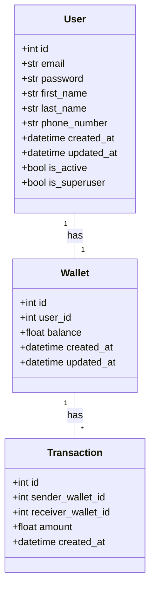
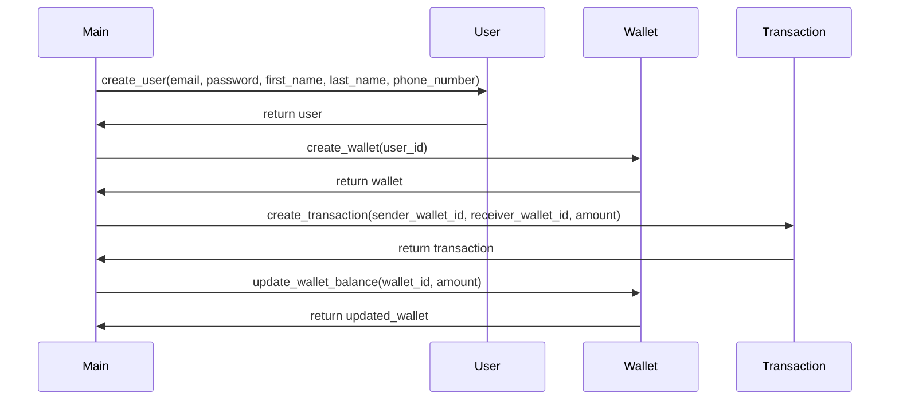

# ewalletBackend

This project was generated using fastapi_template.

   <a href="https://codespaces.new/cashgrabbers/Backend"></a>
## Poetry

This project uses poetry. It's a modern dependency management
tool.

To run the project use this set of commands:

```bash
poetry install
poetry run python -m ewalletBackend
```

This will start the server on the configured host.

You can find swagger documentation at `/api/docs`.

You can read more about poetry here: https://python-poetry.org/

## Docker

You can start the project with docker using this command:

```bash
docker-compose -f deploy/docker-compose.yml --project-directory . up --build
```

If you want to develop in docker with autoreload add `-f deploy/docker-compose.dev.yml` to your docker command.
Like this:

```bash
docker-compose -f deploy/docker-compose.yml -f deploy/docker-compose.dev.yml --project-directory . up --build
```

This command exposes the web application on port 8000, mounts current directory and enables autoreload.

But you have to rebuild image every time you modify `poetry.lock` or `pyproject.toml` with this command:

```bash
docker-compose -f deploy/docker-compose.yml --project-directory . build
```

## Project structure

```bash
$ tree "ewalletBackend"
ewalletBackend
├── conftest.py  # Fixtures for all tests.
├── db  # module contains db configurations
│   ├── dao  # Data Access Objects. Contains different classes to interact with database.
│   └── models  # Package contains different models for ORMs.
├── __main__.py  # Startup script. Starts uvicorn.
├── services  # Package for different external services such as rabbit or redis etc.
├── settings.py  # Main configuration settings for project.
├── static  # Static content.
├── tests  # Tests for project.
└── web  # Package contains web server. Handlers, startup config.
    ├── api  # Package with all handlers.
    │   └── router.py  # Main router.
    ├── application.py  # FastAPI application configuration.
    └── lifetime.py  # Contains actions to perform on startup and shutdown.
```

## Configuration

This application can be configured with environment variables.

You can create `.env` file in the root directory and place all
environment variables here.

All environment variables should start with "EWALLETBACKEND_" prefix.

For example if you see in your "ewalletBackend/settings.py" a variable named like
`random_parameter`, you should provide the "EWALLETBACKEND_RANDOM_PARAMETER"
variable to configure the value. This behaviour can be changed by overriding `env_prefix` property
in `ewalletBackend.settings.Settings.Config`.

An example of .env file:
```bash
EWALLETBACKEND_RELOAD="True"
EWALLETBACKEND_PORT="8000"
EWALLETBACKEND_ENVIRONMENT="dev"
```

You can read more about BaseSettings class here: https://pydantic-docs.helpmanual.io/usage/settings/

## Pre-commit

To install pre-commit simply run inside the shell:
```bash
pre-commit install
```

pre-commit is very useful to check your code before publishing it.
It's configured using .pre-commit-config.yaml file.

By default it runs:
* black (formats your code);
* mypy (validates types);
* isort (sorts imports in all files);
* flake8 (spots possible bugs);


You can read more about pre-commit here: https://pre-commit.com/


## Running tests

If you want to run it in docker, simply run:

```bash
docker-compose -f deploy/docker-compose.yml -f deploy/docker-compose.dev.yml --project-directory . run --build --rm api pytest -vv .
docker-compose -f deploy/docker-compose.yml -f deploy/docker-compose.dev.yml --project-directory . down
```

For running tests on your local machine.


2. Run the pytest.
```bash
pytest -vv .
```


## Original Requirements
The boss wants to create a secure e-wallet app system that enables digital payments and expands financial access. The app must allow users to securely register and login to the e-wallet using email/password or social login like Google or Facebook. The app should use JSON Web Tokens for authentication. Users should be able to add bank accounts/cards, view balances, and transfer money between accounts within the e-wallet. The app should integrate with payment gateways like Stripe to enable loading money into the e-wallet from bank accounts or cards. The app should enable P2P payments to other users via email/mobile number within the e-wallet. The app should use industry standard practices like hashing passwords, encryption, HTTPS, etc. The app should implement 2-factor authentication for sensitive actions like withdrawals. The app should use end-to-end encryption for all payment transactions. No sensitive user data should be stored in plain text. The app should have comprehensive unit, integration and e2e tests. The tech stack to be used includes FastAPI, SQLAlchemy, Pydantic, Asyncio, Websockets, Stripe Python, PyTest, Tox, Docker, Kubernetes, Flower, Sentry SDK, Redis, Celery, MkDocs, and Python's built-in cryptographic libraries.

## Product Goals
```python
[
    "Create a secure e-wallet app that enables digital payments and expands financial access.",
    "Ensure user data security and privacy with industry standard practices.",
    "Provide a seamless user experience for managing and transferring money."
]
```

## User Stories
```python
[
    "As a user, I want to securely register and login to the e-wallet using my email/password or social login.",
    "As a user, I want to add my bank accounts/cards, view my balances, and transfer money between accounts within the e-wallet.",
    "As a user, I want to load money into the e-wallet from my bank accounts or cards.",
    "As a user, I want to make P2P payments to other users via email/mobile number within the e-wallet.",
    "As a user, I want my sensitive actions like withdrawals to be secured with 2-factor authentication."
]
```

## Competitive Analysis
```python
[
    "PayPal: A well-established digital wallet with a wide user base. However, it has high transaction fees and customer service issues.",
    "Venmo: Popular for P2P payments, especially among younger users. It lacks some features for business use.",
    "Google Wallet: Integrated with other Google services, but not as widely used for P2P payments.",
    "Square Cash: Known for business use, but less popular for personal use.",
    "Stripe: Known for its API and integration with businesses, but not typically used as a personal digital wallet.",
    "Apple Pay: Popular among Apple users, but limited to Apple devices.",
    "Samsung Pay: Similar to Apple Pay, but for Samsung devices."
]
```

## Competitive Quadrant Chart


## Requirement Analysis
The product should be a secure e-wallet app that allows users to register and login, add bank accounts/cards, view balances, transfer money, load money, and make P2P payments. It should use industry standard security practices and have comprehensive tests. The tech stack should include FastAPI, SQLAlchemy, Pydantic, Asyncio, Websockets, Stripe Python, PyTest, Tox, Docker, Kubernetes, Flower, Sentry SDK, Redis, Celery, MkDocs, and Python's built-in cryptographic libraries.

## Requirement Pool
```python
[
    ("Secure registration and login system with email/password or social login", "P0"),
    ("Ability to add bank accounts/cards, view balances, and transfer money", "P0"),
    ("Integration with payment gateways like Stripe for loading money", "P0"),
    ("P2P payments to other users via email/mobile number", "P0"),
    ("2-factor authentication for sensitive actions like withdrawals", "P0")
]
```

## UI Design draft
The app should have a clean and intuitive interface. The home screen should display the user's balance and recent transactions. There should be clear options for adding bank accounts/cards, transferring money, and making P2P payments. Sensitive actions like withdrawals should prompt for 2-factor authentication. The app should use a neutral color scheme with high contrast for readability.


## Implementation approach
We will use FastAPI for building the APIs as it is a modern, fast (high-performance), web framework for building APIs with Python 3.6+ based on standard Python type hints. SQLAlchemy will be used for the ORM to interact with the database. Pydantic will be used for data validation and settings management using Python type annotations. Asyncio will be used for handling asynchronous operations. Websockets will be used for real-time communication. Stripe Python will be used for integrating with the Stripe payment gateway. PyTest and Tox will be used for running tests. Docker and Kubernetes will be used for containerization and orchestration. Flower will be used for real-time monitoring of Celery tasks. Sentry SDK will be used for error tracking. Redis and Celery will be used for task queue management. MkDocs will be used for documentation. Python's built-in cryptographic libraries will be used for encryption and hashing.

## Python package name
```python
"secure_ewallet"
```

## File list
```python
[
    "main.py",
    "models.py",
    "schemas.py",
    "routers.py",
    "tests.py",
    "config.py",
    "auth.py",
    "utils.py",
    "database.py",
    "exceptions.py",
    "middlewares.py",
    "tasks.py"
]
```

## Data structures and interface definitions


## Program call flow


## Anything UNCLEAR
The requirement is clear to me.


## Required Python third-party packages
```python
"""
fastapi==0.63.0
sqlalchemy==1.3.23
pydantic==1.8.1
asyncio==3.4.3
websockets==8.1
stripe==2.55.0
pytest==6.2.2
tox==3.23.0
docker==4.4.4
kubernetes==12.0.1
flower==0.9.7
sentry-sdk==1.0.0
redis==3.5.3
celery==5.0.5
mkdocs==1.1.2
bcrypt==3.2.0
"""
```

## Required Other language third-party packages
```python
"""
No third-party packages required in other languages.
"""
```

## Full API spec
```python
"""
openapi: 3.0.0
info:
  title: Secure eWallet API
  version: 1.0.0
paths:
  /users:
    post:
      summary: Create a new user
      requestBody:
        required: true
        content:
          application/json:
            schema:
              $ref: '#/components/schemas/User'
      responses:
        '200':
          description: User created successfully
          content:
            application/json:
              schema:
                $ref: '#/components/schemas/User'
  /wallets:
    post:
      summary: Create a new wallet
      requestBody:
        required: true
        content:
          application/json:
            schema:
              $ref: '#/components/schemas/Wallet'
      responses:
        '200':
          description: Wallet created successfully
          content:
            application/json:
              schema:
                $ref: '#/components/schemas/Wallet'
  /transactions:
    post:
      summary: Create a new transaction
      requestBody:
        required: true
        content:
          application/json:
            schema:
              $ref: '#/components/schemas/Transaction'
      responses:
        '200':
          description: Transaction created successfully
          content:
            application/json:
              schema:
                $ref: '#/components/schemas/Transaction'
components:
  schemas:
    User:
      type: object
      properties:
        id:
          type: integer
        email:
          type: string
        password:
          type: string
        first_name:
          type: string
        last_name:
          type: string
        phone_number:
          type: string
        created_at:
          type: string
          format: date-time
        updated_at:
          type: string
          format: date-time
        is_active:
          type: boolean
        is_superuser:
          type: boolean
    Wallet:
      type: object
      properties:
        id:
          type: integer
        user_id:
          type: integer
        balance:
          type: number
        created_at:
          type: string
          format: date-time
        updated_at:
          type: string
          format: date-time
    Transaction:
      type: object
      properties:
        id:
          type: integer
        sender_wallet_id:
          type: integer
        receiver_wallet_id:
          type: integer
        amount:
          type: number
        created_at:
          type: string
          format: date-time
"""
```

## Logic Analysis
```python
[
    ("main.py", "Contains the main entry point for the application. Initializes FastAPI application and includes routers."),
    ("models.py", "Contains SQLAlchemy models for User, Wallet and Transaction."),
    ("schemas.py", "Contains Pydantic models for User, Wallet and Transaction."),
    ("routers.py", "Contains FastAPI routers for User, Wallet and Transaction."),
    ("tests.py", "Contains PyTest tests for all the APIs."),
    ("config.py", "Contains configuration variables for the application."),
    ("auth.py", "Contains authentication related utilities."),
    ("utils.py", "Contains utility functions."),
    ("database.py", "Contains database connection and session management utilities."),
    ("exceptions.py", "Contains custom exceptions."),
    ("middlewares.py", "Contains custom middlewares."),
    ("tasks.py", "Contains Celery tasks.")
]
```

## Task list
```python
[
    "config.py",
    "database.py",
    "models.py",
    "schemas.py",
    "auth.py",
    "utils.py",
    "exceptions.py",
    "middlewares.py",
    "routers.py",
    "tasks.py",
    "tests.py",
    "main.py"
]
```

## Shared Knowledge
```python
"""
'config.py' contains configuration variables for the application. These variables are loaded from environment variables and have default values.

'database.py' contains utilities for connecting to the database and managing database sessions. It uses SQLAlchemy for ORM.

'auth.py' contains utilities for handling user authentication. It uses bcrypt for password hashing.

'utils.py' contains utility functions that can be used throughout the application.

'middlewares.py' contains custom middlewares. Middlewares are used to process requests and responses globally before they reach route handlers or after they leave route handlers.

'tasks.py' contains Celery tasks. These tasks are asynchronous and can be used for long running operations.
"""
```
